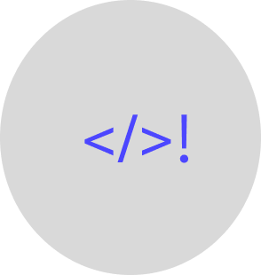

<p align="center">
  
</p>

<h1 align="center">CmdVault</h1>

<p align="center">
  <strong>Command Line Quick Reference &amp; Interactive Developer Cheat Sheet</strong>
</p>

<p align="center">
  <a href="https://cmd-valut.vercel.app/"></a>
  <a href="https://cmd-valut.vercel.app/"></a>
  <a href="LICENSE"></a>
  
</p>

<p align="center">
  <a href="https://cmd-valut.vercel.app/">🚀 <b>Explore Live Application</b></a> •
  <a href="#-features">✨ Features</a> •
  <a href="#-project-structure">📁 Architecture</a> •
  <a href="#-getting-started">💻 Getting Started</a> •
  <a href="#-security--privacy">🔒 Security</a> •
  <a href="#-contact--author">📬 Contact</a>
</p>

---

> 🚧 **PROJECT NOTICE**: This repository is actively **flagged as under-development**.  
> Features, command collections, and shortcuts are regularly updated.  
> **Live Production Website**: [https://cmd-valut.vercel.app/](https://cmd-valut.vercel.app/)

---

## 📖 Overview

**CmdVault** is a fast, responsive, and developer-centric command line reference tool built with a clean **Google Material 3 / Google Cloud Shell** dark aesthetic. It is engineered to give developers, sysadmins, database administrators, and DevOps engineers instant access to essential commands and queries across **GitHub & Git**, **Linux & Bash**, **Windows PowerShell**, **MySQL**, **PostgreSQL**, **Python**, and **Node.js**.

No heavy frameworks, no bloated bundles — CmdVault is crafted in **pure semantic HTML5, modern CSS3, and modular vanilla JavaScript**, delivering zero-latency search, instantaneous 1-click clipboard copying, and edge performance on Vercel.

---

## ✨ Features

### 🎨 Design & Experience
- **Google Material 3 Aesthetic**: Deep background (`#131314`), elevated surface cards (`#1e1f20`), Google Blue accents (`#8ab4f8`), and crisp terminal typography using local `Google Sans Flex` and `Google Sans Code`.
- **Full-Width Modern Layout**: Edge-to-edge navigation and category bars that seamlessly scale across ultrawide monitors and mobile screens.
- **Dynamic Dark / Light Theme**: Seamless theme toggling with high-contrast icon adaptations and persistent user preferences stored in `localStorage`.
- **100% Mobile Responsive**: Fluid breakpoints, full-width collapsible search input, touch-friendly tap targets, and horizontal swipeable category tabs.

### ⚡ Productivity & Commands
- **Instant Keyword Search**: Real-time filtering across commands, syntax, and descriptions with visual `<mark>` highlighting.
- **Global Keyboard Shortcut**: Press <kbd>/</kbd> anywhere on the page to instantly focus and type in the search bar.
- **Multi-OS Filter Chips**: Filter commands by **Windows**, **Linux**, or **macOS** with high-contrast platform icons.
- **1-Click Clipboard Copy**: One-click copying with an animated green checkmark confirmation and a Google Material 3 snackbar toast.

### 🔐 Security & Architecture
- **Zero-Secret Client Architecture**: API keys are completely isolated from GitHub using `.gitignore` and dynamic Vercel serverless `/api/config` runtime injection.
- **GitHub OAuth Authentication**: One-click sign-in powered by Firebase Authentication to personalize developer sessions.
- **Complete Compliance Suite**: Standalone, dedicated pages for **Privacy Policy**, **Terms & Conditions**, **Cookies Policy**, and **Contact Us**.

---

## 🗂️ Supported Command Categories

| Ecosystem | Focus Areas | Key Capabilities |
| :--- | :--- | :--- |
| **GitHub & Git** | Setup, Init, Staging, Branching, Merging, Remote Updates, History Rewrites | Global configurations, commit snapshots, interactive rebase, cherry-pick, stash, branch management |
| **Linux & Bash** | Filesystem, Searching, Permissions, Diagnostics, Processes, Disk Usage, Systemd, Users, Networking, SSH/SCP, Package Managers, I/O Pipes, Compression | `chmod`, `systemctl`, `journalctl`, `grep`, `lsof`, `ip`, `ssh-keygen`, `apt/pacman/dnf`, `tee`, `tar` |
| **PowerShell** | Navigation, Process Control, Admin Scripts, Network Diagnostics | `Get-Service`, `Stop-Process`, `Test-NetConnection`, execution policies, package management |
| **MySQL** | Databases, Tables, DDL/DML, Joins, Indexes, Transactions, User Security, Administration, mysqldump | `CREATE DATABASE`, `SELECT ... JOIN`, `INSERT ... ON DUPLICATE`, `CREATE INDEX`, `START TRANSACTION`, `GRANT`, `mysqldump` |
| **PostgreSQL** | CLI Meta-Commands, Schemas, JSONB, CTEs, Window Functions, Upsert, Indexes, VACUUM, pg_dump | `\dt`, `\d`, `JSONB ->>`, `WITH RECURSIVE`, `ON CONFLICT DO UPDATE`, `EXPLAIN (ANALYZE)`, `pg_dump` |
| **Python** | Pip Package Management, Virtual Environments (venv, conda), Modern Tools (poetry, uv), CLI Execution, Built-in Modules, Debugging, Testing, Quality, Packaging | `pip install`, `python -m venv`, `poetry`, `uv`, `python -m http.server`, `python -m pdb`, `pytest`, `black`, `ruff`, `build`, `twine` |
| **Node.js** | NPM Package Management, Auditing, NPX Runners, V8 Flags, Debugging & Profiling, PM2 Process Clustering, NVM/FNM Versions, PNPM/Yarn, Native Testing, Registry Publishing | `npm install`, `npm ci`, `npx`, `node --watch`, `node --inspect`, `pm2 start -i max`, `nvm use`, `pnpm install`, `node --test`, `npm publish` |

---

## 📁 Project Structure

```
CmdVault/
├── index.html            # Main semantic application dashboard
├── contact.html          # Dedicated maintainer & feedback contact page
├── privacy.html          # GDPR & GitHub OAuth Privacy Policy
├── terms.html            # Terms of Service & terminal command execution disclaimer
├── cookies.html          # Cookie and storage usage policy
├── css/
│   └── style.css         # Google Material 3 design system, typography & themes
├── js/
│   ├── app.js            # Core application controller (search, copy, rendering, theme)
│   ├── commands-data.js  # Curated database of terminal commands and explanations
│   ├── firebase-config.js# Firebase Authentication & GitHub OAuth runtime loader
│   └── env.template.js   # Public environment variable template
├── api/
│   └── config.js         # Vercel Serverless Function serving secure runtime config
├── images/
│   ├── logo.png          # CmdVault circular brand logo
│   └── Group 1.png       # Original vector asset
├── icons/                # System SVGs & icons (copy, search, sun, OS logos)
├── font-familiy/         # Local Google Sans Flex & Google Sans Code TTF font files
├── vercel.json           # Edge caching headers, clean URLs & security directives
├── .env.example          # Safe environment variables template
└── README.md             # Project documentation
```

---

## 💻 Getting Started

### Prerequisites
- Any modern web browser (Chrome, Firefox, Safari, Edge).
- (Optional) Python 3, Node.js, or any local static web server.

### 1. Clone the Repository
```bash
git clone https://github.com/parthongit89/CmdValut.git
cd CmdValut
```

### 2. Configure Local Environment (Optional for Auth)
To test GitHub Authentication locally, copy `.env.example` to `js/env.js`:
```bash
cp .env.example .env
```
Add your Firebase Web credentials to `.env`. Both `.env` and `js/env.js` are strictly ignored by `.gitignore` and will never be pushed.

### 3. Run Locally
Start a local static server:

```bash
# Using Python:
python -m http.server 8080

# Or using Node.js npx:
npx serve .
```

Open your browser at:
```text
http://localhost:8080
```

---

## 🌐 Production Deployment (Vercel)

CmdVault is optimized for zero-configuration deployment on **Vercel**:

1. **Connect Repository**: Import `parthongit89/CmdValut` into your Vercel dashboard.
2. **Set Environment Variables**: In Vercel Project Settings &rarr; **Environment Variables**, add:
   - `FIREBASE_API_KEY`
   - `FIREBASE_AUTH_DOMAIN`
   - `FIREBASE_PROJECT_ID`
   - `FIREBASE_STORAGE_BUCKET`
   - `FIREBASE_MESSAGING_SENDER_ID`
   - `FIREBASE_APP_ID`
   - `FIREBASE_MEASUREMENT_ID`
3. **Authorize Vercel Domain in Firebase**:
   - Go to **Firebase Console &rarr; Authentication &rarr; Settings &rarr; Authorized domains**.
   - Add `cmd-valut.vercel.app`.
4. **Deploy**: Every push to `main` triggers an automatic edge deployment.

---

## 🔒 Security & Privacy

- **Zero Secrets in Git**: Sensitive credentials, API keys, and internal reference PDFs are permanently excluded from Git tracking via `.gitignore`.
- **Command Safety Disclaimer**: Terminal commands (especially destructive operations like `rm -rf` or `git reset --hard`) are provided for reference only. Users must verify all commands before execution.
- **Read Our Policies**:
  - [Privacy Policy](https://cmd-valut.vercel.app/privacy)
  - [Terms & Conditions](https://cmd-valut.vercel.app/terms)
  - [Cookies Policy](https://cmd-valut.vercel.app/cookies)

---

## 🤝 Contributing

Contributions, feedback, and command suggestions are welcome!

1. Fork the Project.
2. Create your Feature Branch (`git checkout -b feature/NewCommand`).
3. Commit your Changes (`git commit -m 'feat: add docker & k8s commands'`).
4. Push to the Branch (`git push origin feature/NewCommand`).
5. Open a Pull Request.

---

## 📬 Contact & Author

CmdVault is designed, maintained, and developed by:

- **Author**: **Parth Sonavane**
- **GitHub**: [@parthongit89](https://github.com/parthongit89)
- **Email**: [sonavaneparthgit@gmail.com](mailto:sonavaneparthgit@gmail.com)
- **Contact Page**: [https://cmd-valut.vercel.app/contact](https://cmd-valut.vercel.app/contact)

---

## 📄 License

Distributed under the **MIT License**. See [`LICENSE`](LICENSE) for more information.

<p align="center">
  <sub>Built with ❤️ for developers by Parth Sonavane • CmdVault © 2026</sub>
</p>
